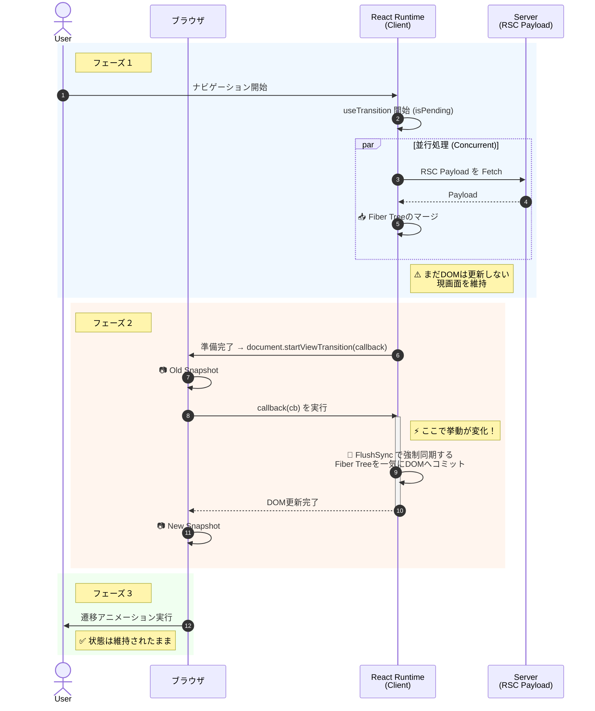

## はじめに

ウェブフロントエンド開発のエコシステムは成熟期を迎えました。長らくウェブ開発の議論を二分してきた「シングルページアプリケーション（SPA）」と「マルチページアプリケーション（MPA）」という二項対立は、View Transition APIの標準化と普及により、その境界線を溶解させつつあります。

View Transition APIは、MPAであってもSPAのようなシームレスな体験を実装でき、SPAにおいては複雑なアニメーションライブラリに依存せず、宣言的な遷移アニメーションが実現できます。

@[stackblitz](https://stackblitz.com/edit/withastro-astro-9ffuqoiz?embed=1&file=src%2Fpages%2Findex.astro&view=preview)

この記事ではNext.js（App Router）とAstroに焦点を当て、各フレームワークがView Transition APIをどのように実装し、統合しているかを解説します。View Transition APIという共通のレンズを通すことで、React Server Components（RSC）による「状態駆動型」と、Islands Architectureによる「DOM駆動型」、それぞれの根本的なアーキテクチャ思想の差異を浮き彫りにすることを目的とします。

## View Transition APIの動作原理

各フレームワークの実装に踏み込む前に、基盤となるブラウザのメカニズムを整理しましょう。これは単なるCSSアニメーションの拡張ではなく、ブラウザのレンダリングパイプラインへの深い介入です。

https://developer.mozilla.org/en-US/docs/Web/API/View_Transition_API

View Transition APIの核となるのは、[document.startViewTransition()](https://drafts.csswg.org/css-view-transitions-1/#customizing) です。このメソッドが呼び出されると、ブラウザはレンダリングループを一時停止し、厳密なステップを踏みます。

1.  現在の画面を画像としてキャプチャします（Old Snapshot）。
2.  レンダリングを凍結し、ユーザーにはキャプチャしたスナップショットを表示し続けます。
3.  コールバック関数を実行し、DOMの更新を完了させます。
4.  更新後の新しい画面をキャプチャします（New Snapshot）。
5.  新旧のスナップショット間で、CSSに基づいたクロスフェードや位置移動のアニメーションを実行します。

この[デモサイト](https://http203-playlist.netlify.app/)も触ってみてください。より自然なページ遷移が体験できるはずです。

## AstroのDOM駆動アプローチ

AstroはIslands Architectureを標榜し、デフォルトでJavaScriptを排除するHTMLファーストのフレームワークです。Astroで作られたサイトは典型的なMPAであり、本来ページ遷移は「ドキュメントの破棄と再読み込み」を意味します。

しかし、View Transition APIをサポートするために導入された `<ClientRouter />`（旧 `<ViewTransitions />`）コンポーネントは、MPAの前提を覆します。

```ts:index.astro
---
import { ClientRouter } from 'astro:transitions';
---
<html lang="ja">
  <head>
    <title>title</title>
    <ClientRouter />　// ClientRouterコンポーネントをimportして使用します。
  </head>
  <body>
    <h1>Astro Demo</h1>
    <a href="/page2">
      次のページへ
    </a>
  </body>
</html>
````

### なぜAstroは「SPAのふり」をするのか

AstroにおけるView Transitionの実装は、いわば「MPAのふりをしたSPA」です。なぜAstroは、MPAというアイデンティティを持ちながら、わざわざSPAのようなクライアントサイドルーターを導入したのでしょうか。そこには、View Transition APIの仕様における2つのモードが関係しています。

1.  Same-Document View Transitions (通称 Level 1)
    [単一のドキュメント内でDOMを書き換えるモード](https://drafts.csswg.org/css-view-transitions-1/#intro)。SPAでの利用が想定されており、JavaScriptでAPIを呼び出し、コールバック内でDOMを更新します。ブラウザはページ遷移と認識しないため、JavaScriptの状態は維持されます。

2.  Cross-Document View Transitions (通称 Level 2)
    [異なるドキュメント間を遷移するモード](https://drafts.csswg.org/css-view-transitions-2/#cross-document-view-transitions)。MPAでの利用が想定されています。CSSのみで有効化できますが、遷移中の細かい制御や複雑な状態の引継ぎには制約があります。

本来MPAであるAstroは「Cross-Document (Level 2)」と相性が良いはずです。しかし、Level 2はまだ仕様策定やブラウザ実装の途上にあります。そこでAstroは、現時点でリッチな体験を提供するために、「MPAのふりをしたSPA」として振る舞うというプラグマティックな道を選びました。

`<ClientRouter />` がリンクのクリックをインターセプトし、fetchで次ページのHTMLを取得して書き換えることで、擬似的にSame-Document (Level 1) の環境を作り出しています。これにより、MPAの簡潔さを保ちつつ、SPA並みのリッチな制御を可能にしているのです。

### transition:persist による物理的なDOMスワップ

この擬似的なSPA化において、Astroが提供する機能が[transition:persist](https://www.google.com/search?q=https://docs.astro.build/en/guides/view-transitions/%23transitionpersist)です。

https://x.com/astrodotbuild/status/1689742663116115969?s=20

通常、bodyをHTML文字列で入れ替えれば、`<video>` の再生位置や `<canvas>` の描画内容はリセットされてしまいます。これを防ぐため、AstroはDOMノードの物理的なスワップ（移植）を行います。

スワップ直前、対象のDOMノードを現在のツリーから切断し、メモリ上に退避させます。この時点でノードはドキュメント（DOMツリー）から外れますが、JavaScriptインスタンスとしては生きており、内部状態を保持し続けます。そして、新しいHTMLが挿入された後、対応するプレースホルダー部分を、退避させておいた「生きたDOMノード」で置き換えます。

これはReactによる差分検知とは根本的に異なります。Reactが「コンポーネントの状態（PropsやState）を維持してビューを再描画」するのに対し、Astroは「物理的なDOMノードそのものを移動」させます。これにより、フレームワーク固有のライフサイクルに依存せず、ブラウザネイティブの状態を維持できる点は、AstroのDOM駆動思想を象徴しています。

## Next.jsにおける状態駆動アプローチ

一方、Next.jsにおけるView Transitionは、アプローチが全く異なります。ブラウザのネイティブAPIをそのまま使うのではなく、Reactの同時実行レンダリング（Concurrent Rendering）機構の中に、同期的なDOM更新を「埋め込む」という高度な統御を行っています。

その構造は、大きく3つのフェーズで動作します。

#### 1. RSC Payloadによる論理更新

ナビゲーションがトリガーされると、Next.jsは新しいHTMLページを取得するのではなく、RSC Payload（シリアライズされたReact Server Componentsのデータ）を取得します。

1.  サーバーでレンダリングされた差分データ（Payload）がクライアントに流れてきます。
2.  クライアント上のReactランタイムがこれをデシリアライズし、React Element（UIの定義情報）を生成します。
3.  生成されたReact Elementをもとに、メモリ上のFiber Tree（アプリケーションの状態を保持する内部ツリー）を更新やマージします。

ここでは物理的なDOMの総入れ替えではなく、React内部のFiber Tree上での論理的なマージが行われます。これにより、Fiber Nodeに保持されているState（動画の再生状態やフォームの入力値など）が維持されます。

#### 2. useTransitionによる表示タイミングの制御

View Transition APIは「遷移完了後の完成された画面」へのアニメーションを前提とします。しかし、Reactのレンダリング（特にStreamingやSuspenseを伴う場合）は非同期かつ段階的です。このギャップを埋めるのが `useTransition` です。

1.  ナビゲーション開始時、Reactは `isPending` 状態になり、バックグラウンド（メモリ上のFiber Tree）で次の画面のレンダリングを開始します。
2.  データ取得が完了し、次の画面の描画準備が整うまで、現在のDOM（画面）を一切変更せず維持します。
3.  準備完了のシグナルが出た瞬間に、次のフェーズへ移行します。

ブラウザが勝手に遷移を始めるのを防ぎ、Reactが「いつ遷移を開始するか」の全権限を掌握します。これにより「ローディングスピナーが表示される画面への遷移」といった不要な中間状態を防いでいます。

#### 3. flushSyncによる強制的DOM更新

ここがNext.js (React) の実装において難解であり、かつ凄みを感じる点です。ブラウザの `document.startViewTransition(callback)` は、`callback` 内でDOMが同期的に更新されることをリクエストします。しかし、Reactのコミットフェーズ（Fiber TreeからDOMへの反映）は、Concurrent Featuresにおいては中断か非同期になることがあります。

そこでReactは以下のような挙動をとります。

1.  Reactは準備が整った新しいFiber TreeをDOMに反映する際、並列処理の「優先度付き更新」を一時停止します。
2.  `startViewTransition` のコールバック関数内で、`flushSync` 相当の処理を実行し、強制的に同期的なDOMコミットを行います。
3.  これにより、ブラウザは「Old Snapshot」と「New Snapshot」の間にあるDOMの変化を、一瞬の空白もなく連続的にキャプチャできます。

非同期で動くReactのFiberアーキテクチャと、同期を求めるブラウザAPIの世界を接続するためのブリッジ処理がランタイム深部に組み込まれているのです。



これは、View Transition APIとの同期時、Reactは計算済みの全てのDOM変更（コミットフェーズ）を単一のタスクとして実行することを意味します。巨大なFiber Treeの変更を伴うとき、このDOM反映処理が完了するまでメインスレッドを占有します。リッチなアプリケーションでは、この一瞬のフリーズがユーザー体験に影響する可能性すらありますが、そこまでしてもReactは「状態の一貫性」を優先していると言えます。

## まとめ

AstroとNext.jsは、同じView Transition APIを利用しながらも、そのアプローチは対照的です。

| 特徴 | Astro (DOM駆動) | Next.js (状態駆動) |
| :--- | :--- | :--- |
| 遷移の仕組み | HTMLをFetchしてDOMを総入れ替え | RSC PayloadをFetchしてFiber Treeをマージ |
| 状態の維持 | `transition:persist` による物理的なDOM退避 | React State / Context による論理的な維持 |
| JSへの依存 | 小（必要な部分のみIslandsとして動作） | 大（巨大なランタイムがDOMを管理） |
| 設計思想 | Polyfillぽさ。<br>将来的に標準API (Level 2) に準拠し、ルーターを捨てられる設計。 | 統合ぽさ。<br>標準APIを素材として取り込み、独自のUXを提供するためのランタイムへ統合。 |

Astroのアプローチは、将来的なウェブ標準を見据えたPolyfillに近いと言えます。DOMの置換と要素の永続化による実装は、ブラウザがCross-Document View Transitions (Level 2) をサポートした際には、`<ClientRouter />` を削除しても動作することを目指した、ウェブ標準に寄り添う設計です。「今は泥臭いことをしてでも、標準へ橋渡しをする」という気概を感じます。

対してNext.jsは、View TransitionをReactエコシステムの一部として取り込んでいます。SuspenseやServer Actions、そしてConcurrent Renderingと協調させることで、コンポーネント単位での状態管理とリッチな体験を追求しています。これはウェブ標準をあくまで「素材」として使い、ブラウザの限界を超えた独自のアプリケーションランタイムを構築しようとします。

どちらが優れているという話をしているつもりはありません。ただ、View Transitionという一つの機能を通して見ると、「薄く保ち標準に準拠するAstro」と「厚く作り込み、体験を支配するNext.js」という、両者の設計思想のコントラストが鮮明に浮かび上がってきます。
