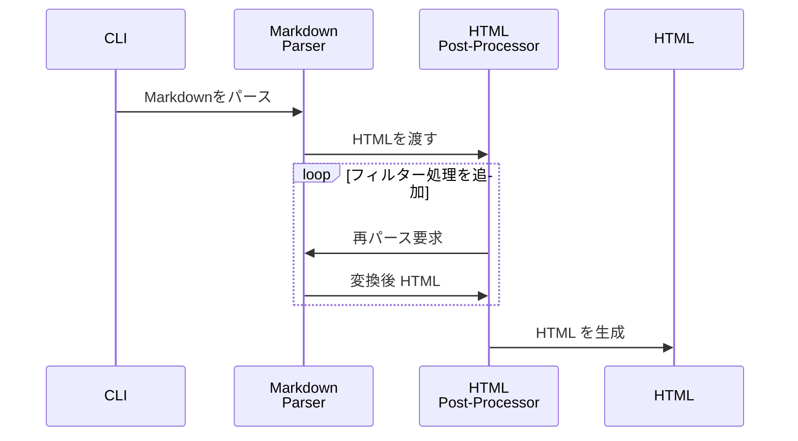
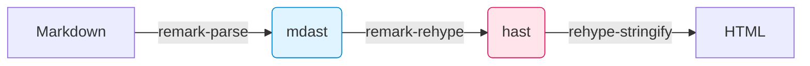

ZennやAstroなどの静的サイトジェネレーターが、どのようにMarkdownを受け取り、最終的なブログ記事やドキュメントを生成しているのか。  

その仕組みに強い関心を抱いた私はAstroの *Content Collections* のソースコードを読み始めました。とりわけ印象的だったのは、フロントマターを抽出する `gray-matter` でメタデータを取り出しつつ、本文をunifiedパイプラインへ流し込む一連の設計です。

この記事では、そうした実装を眺めた好奇心から始まり、多重パース時代の課題、ASTリレーがもたらした転換点やMDX 3・WASM・Edgeが広げる近未来までを、コードと図を交えながら俯瞰します。

## 第一世代：多重パース時代

Markdown変換ライブラリの草創期を支えた `markdown-it` や `marked` は、変換ステップごとに文字列を再パースする仕組みを採っていました。MarkdownをHTMLにしたあと、別のフィルターをかけるたびにHTMLを再び文字列として読み込み直し、新しいASTを作り直していたのです。

次のシーケンス図が示すように、ASTを何度も破棄・再生成するループがボトルネックを生み出していました。



ファイル数が百単位から千単位に増えた途端、ビルドが劇的に遅くなる原因はこのループにあったのです。

## 第二世代：AST リレーの誕生

unifiedでは再パースを排し、速度を生みました。unifiedの核心は「1つのASTをリレーする」設計にあります。これは駅伝のようなもので、各プラグインがランナーとなってASTというバトンを次々と受け渡していくイメージです。

従来の方法では、手紙を何度も封筒に入れ直すように、各変換ステップで文字列→パース→変換→文字列化を繰り返していました。

remarkプラグインはmdastを直接操作し、rehypeプラグインはhastを直接操作します。`remark-rehype` はmdastをhastに変換するだけで、文字列化は行いません。この「木構造をメモリ上で受け渡す」アプローチが、高速な処理を可能にしているのです。

```ts:example.ts
import { unified } from 'unified';
import remarkParse from 'remark-parse';
import remarkRehype from 'remark-rehype';
import rehypeStringify from 'rehype-stringify';

export const mdProcessor = unified()
  .use(remarkParse)        // Markdown → mdast
  .use(remarkRehype)       // mdast → hast
  .use(rehypeStringify);   // hast → HTML
```



Markdownの世界だけで閉じたremarkを使い始めても、HTMLや自然言語処理へステップアップするときにAPIと思考法を一切変えずに済むのがunifiedがもつ最大の利点と言えます。

AstroがContent CollectionsでASTリレーを実現する過程は、わずか3つの関数で完結しています。get → collect → pipelineの一直線です。

### 余談：gray-matter の位置づけ

では冒頭で書いた `gray-matter` はどこに入るのかと疑問を持たれるかもしれません。Astroをはじめ多くのSSGは、**本文をパイプラインに渡す前**にfront-matterを抽出します。その役割を担うのがgray-matterです。あくまで **メタデータ用の前処理**であり、本文のAST変換には出てきません。そのため本稿では核心を成すASTリレーを中心に語り、`gray-matter`は余談として書きました。

とはいえfront-matterを型安全に扱う上で不可欠な存在であり、Astro Content Collectionsが型推論を成立させている背景にも`gray-matter`が密接に関わっています。

## 第3世代：インタラクティブ拡張が標準に 

2023年にGAしたMDX 3により、Markdown記事は「ライブコードを埋め込めて当たり前」という現在の期待値へシフトし、rehype-mdx-code-propsはメタ文字列をそのままJSX propsへ橋渡しする標準手段として機能しています。

MDX 3はJSXとESMが衝突しないASTを打ち立てました。rehype-mdx-code-props v3は “メタ文字列をそのままpropsに写像できました"。

```mdx:example.mdx
```js live run filename="Counter.jsx"
export default function Counter() {
  const [n, set] = React.useState(0);
  return <button onClick={() => set(v => v + 1)}>{n}</button>;
}
``` 

上の1行目をrehype-mdx-code-propsが分解し、`<pre live run filename="Counter.jsx">` という **属性付きノード** を生成します。パイプラインの途中で再パースは起こらずASTは木のまま、属性だけが増えます。最終的にMDX 3のコンパイラがJSXに直列化し、`SandpackCode` コンポーネントがそのpropsを受け取ります。結果として **「書くのは 1 行、動くのは IDE 付きのデモ」** という開発体験が成立しています。


## 第4世代：ビルド 0 秒を目指す Edge & WASM

**もし WASM パーサーと Edge 実行環境が本格普及すれば、Markdown→HTML の変換はリクエスト時に行う“ビルド 0 秒”戦略が現実になるかもしれません。**

@logue/markdown-wasmをはじめとするmicromark派生のWASMビルドは2025年現在、gzip後わずか88 KB・依存ゼロでCommonMarkを毎秒400 KiB超で処理します。WasmEdgeのような軽量ランタイム上ならVercel Edge FunctionsやCloudflare Workersのcold-startも数ミリ秒に抑えられるという報告があったのです。

この技術がもたらす最大の変革は **「遅延レンダリング戦略」** の実用化です。front-matter抽出はビルド時に済ませつつ、本文のMarkdown→HTML変換だけをリクエスト時にWASMで処理すれば、「更新ボタンを押して即反映」という体験をビルド工程なしで実現できます。

### Astro Content Graph API ― ライブ CMS への布石

この記事の冒頭にも書いたのですが、Astroの内部実装を眺めています。その時に、目に入ったのが**Content Graph API**です。
Astroチームがロードマップで示す **Content Graph API** が実装されれば、ローカルとリモートのコンテンツを型付きクエリで横断し、変換結果をEdge KVへキャッシュすることでビルド時間を限りなく0秒に近づけるアーキテクチャが可能になるそうです。

### まとめ

この記事では、かつて再パースに悩まされた第1世代から、ASTリレーが定着した第2世代、MDX 3のインタラクティブ拡張が標準化した第3世代、そしてEdge＋WASMでビルド0秒を目指す第4世代までを俯瞰しました。

最後にmarkdown-wasmをEdge Functions上で試せば、本稿で示した進化の一端を手元で体験できます。

詳細なAPIや最新の企画はunifiedjsやAstroのGitHubリポジトリ、またWithAstro Discordで随時アップデートされています。興味を持たれた方はぜひそちらもチェックしてみてください。


