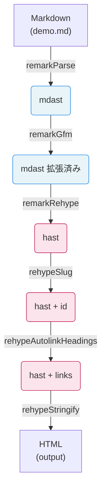
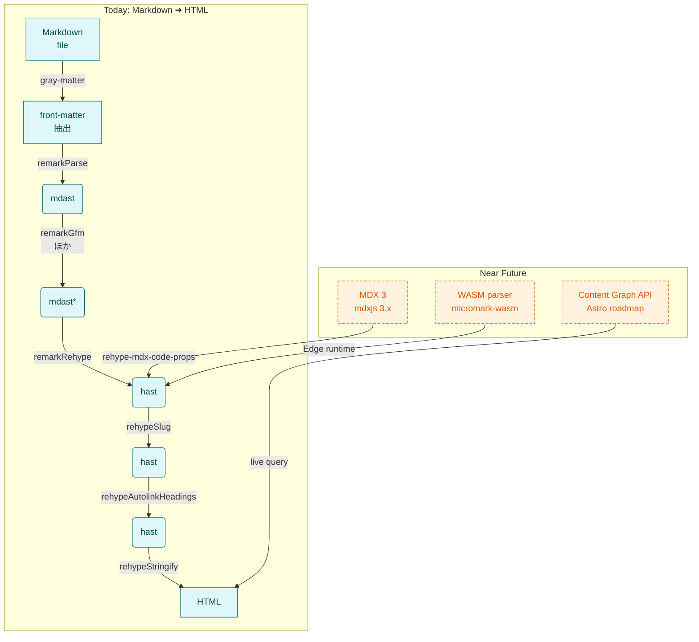

Astroなどの静的サイトジェネレーターが、どのようにMarkdownを受け取り、最終的なブログ記事やドキュメントを生成しているのか――このプロセスに強い関心を抱き、私はAstroのContent Collectionsのソースコードを徹底的に読み込んでみました。特に注目したのは、フロントマターを抽出するgray-matter、抽象構文木（AST）を介して一度のパースで複数の変換を実現するunifiedとremark／rehypeの連携、そしてビルド時のログ体験を刷新するkleur・ora・youchといった補助ライブラリです。これらが絶妙に噛み合うことで、数百〜数千本のMarkdownを型安全に扱いながら、従来より桁違いに高速なビルドを実現していました。本稿では、ソースコードから得た知見をもとに、従来の三重パース地獄がどのように解消され、どんな設計思想でパフォーマンスと開発者体験が両立しているのかを順を追って解説していきます。

# unified パイプラインの仕組みを理解する

## unified パイプラインを体験する

Astroが内部で採用しているunifiedのパイプラインを理解する最良の方法は、シンプルなプロジェクトを自分で作って動かしてみることです。実はunifiedの作者であるTitus Wormerさんは、このライブラリを作る前に100個以上のMarkdownパーサーを試したそうです。その経験から生まれたunifiedの設計思想を、最小限の構成で体験してみましょう。

### プロジェクト構成

まずは `unified-demo` というフォルダを作り、以下のような構成にします。TypeScriptの設定ファイルも含めて、たった4つのファイルで完結する小さなプロジェクトです。

```
unified-demo/
├── src/
│   ├── lib/
│   │   └── pipeline.ts
│   └── demo.md
├── package.json
└── tsconfig.json
```

### pipeline.ts - パイプラインの実装

次に、パイプラインの心臓部となる `pipeline.ts` を実装します。このファイルでは、6つのプラグインを数珠つなぎにして、MarkdownからHTMLへの変換パイプラインを構築します。

```typescript
import { unified } from 'unified';
import remarkParse from 'remark-parse';
import remarkGfm from 'remark-gfm';
import remarkRehype from 'remark-rehype';
import rehypeSlug from 'rehype-slug';
import rehypeAutolink from 'rehype-autolink-headings';
import rehypeStringify from 'rehype-stringify';

export const mdProcessor = unified()
  .use(remarkParse)                              // Markdown → mdast
  .use(remarkGfm)                                // GFM 拡張
  .use(remarkRehype, { allowDangerousHtml: true }) // mdast → hast
  .use(rehypeSlug)                               // 見出しに id 付与
  .use(rehypeAutolink, { behavior: 'wrap' })    // 見出しをリンク化
  .use(rehypeStringify);                         // hast → HTML
```

面白いことに、この `.use()` メソッドのチェーンはjQueryを彷彿とさせますが、内部では全く異なることが起きています。jQueryがDOM要素を操作するのに対し、unifiedは抽象構文木（AST）を次々と変換していくのです。

### demo.md - サンプル Markdown

`demo.md` には、シンプルなMarkdownを書いてみます。たった3行ですが、これだけでパイプラインの動作を確認するには十分です。

```markdown
# Hello unified

- **One parse**  
- _Many transforms_
```

### 実行してみる

準備ができたら、Node.jsで以下のコマンドを実行してみましょう。数ミリ秒でHTMLが出力されるはずです。

```bash
node -e "import('./src/lib/pipeline.ts').then(async m => { 
  const fs = await import('fs');
  const markdown = fs.readFileSync('./src/demo.md', 'utf-8');
  const result = await m.mdProcessor.process(markdown);
  console.log(String(result));
})"
```

ちなみに、この処理時間の短さには秘密があります。従来のMarkdownプロセッサでは、各変換ステップで文字列の再パースが発生していました。しかしunifiedでは、最初に一度だけパースした後は、メモリ上の木構造をそのまま次のプラグインに渡していくのです。

## パイプラインの全体像

では、unifiedのパイプラインで実際に何が起きているのか、Mermaid図で可視化してみましょう。この図を見ると、データが川のように流れていく様子がイメージできるはずです。



### AST（抽象構文木）の変遷

この図で注目すべきは、青色で示されたmdast（Markdown AST）が、ピンク色のhast（HTML AST）に変換される瞬間です。`remark-rehype` がその橋渡し役を担っています。実はこの変換、単純に見えて奥が深く、Markdownの意味的な構造をHTMLの構造に正確にマッピングする必要があります。たとえば、Markdownの `**太字**` はmdastでは `strong` ノードですが、hastでも同じく `strong` 要素になります。この一貫性が、変換の予測可能性を高めているのです。

## なぜ「一度だけ」パースすることが速いのか

unifiedの核心は「1つのASTをリレーする」設計にあります。これは駅伝のようなもので、各プラグインがランナーとなってASTというバトンを次々と受け渡していくイメージです。

従来の方法では、まるで手紙を何度も封筒に入れ直すように、各変換ステップで文字列→パース→変換→文字列化を繰り返していました。これに対してunifiedでは、最初に一度だけ封を開け（パース）、内容物を様々な部署で処理し、最後に新しい封筒に入れる（文字列化）という流れになっています。

remarkプラグインはmdastを直接操作し、rehypeプラグインはhastを直接操作します。`remark-rehype` はmdastをhastに変換するだけで、文字列化は行いません。この「木構造をメモリ上で受け渡す」アプローチが、まるで新幹線のように高速な処理を可能にしているのです。

## Astro での活用とキャッシュ戦略

AstroのContent Collectionsでは、このパイプラインをさらに賢く活用しています。まず `gray-matter` でMarkdownのフロントマター（記事のメタデータ）を抽出し、本文をunifiedパイプラインに渡します。そして、ここからがAstroの真骨頂なのですが、変換結果をファイル単位でキャッシュするのです。

1000個のMarkdownファイルがあるブログを想像してみてください。初回ビルドでは全ファイルを処理しますが、2回目以降は変更されたファイルだけを再処理します。まるで賢い料理人が、作り置きできる料理は事前に準備しておくように、Astroは変換済みのHTMLをキャッシュしておくのです。これが、Astroのビルドが「爆速」と言われる理由の1つです。

unifiedの設計思想を深く理解したい場合は、[unified Handbook](https://github.com/unifiedjs/unified#overview) の "Process once, transform many" の節が必読です。また、[unified の仕組み](https://unifiedjs.com/learn/guide/introduction-to-unified/) では、ASTの概念から実装まで丁寧に解説されています。

各プラグインの詳細については、[remark-rehype](https://github.com/remarkjs/remark-rehype) のドキュメントがmdastからhastへの変換ルールを詳しく説明しています。さらに、[remark プラグイン一覧](https://github.com/remarkjs/remark/blob/main/doc/plugins.md) と [rehype プラグイン一覧](https://github.com/rehypejs/rehype/blob/main/doc/plugins.md) を眺めると、コミュニティの豊富なエコシステムに驚かされるはずです。

Astroでの実装については、[Astro Content Collections](https://docs.astro.build/en/guides/content-collections/) の公式ドキュメントが詳しく、特に [Astro の Markdown 処理](https://docs.astro.build/en/guides/markdown-content/) では内部実装の一端を垣間見ることができます。

unifiedパイプラインの本質は「一度パースしたASTを最後まで使い回す」ことにあります。この一見シンプルな設計が、高速性、拡張性、型安全性という三拍子揃った特徴を生み出しています。

わずか十数行のコードで、この強力なパイプラインを体験できるのもunifiedの魅力です。実際に手を動かして `demo.md` を編集し、どのようなHTMLが生成されるか試してみてください。きっと、その変換の速さと正確さに、思わず「おお！」と声が出るはずです。そして、その感動こそが、unifiedの設計思想を最も雄弁に物語っているのかもしれません。

# unified パイプラインの現在と未来 - ビルド0秒時代への道筋

## 全体像を俯瞰する

unifiedパイプラインの現在の姿と、これから向かう未来を一枚の図に表現してみました。上段が今日の標準的なフローで、下段が近い将来に実現されるであろう新たな可能性を示しています。



この図を見ると、現在のパイプラインがいかに洗練されているか、そして未来の拡張ポイントがどこにあるかが一目瞭然です。特に注目すべきは、下段の3つの新技術がすべて既存のパイプラインに「接ぎ木」される形で統合される点です。

## MDX 3 とコードブロックの新たな可能性

MDX 3は2023年10月24日に正式版がリリースされ、現在はバージョン3.1.0まで細かな改善が重ねられています（[MDX公式リポジトリ](https://github.com/mdx-js/mdx/releases)）。この新バージョンの最大の特徴は、ESMモジュールとJSXをASTに混在させても型安全性が保たれるよう、内部実装が全面的に書き直されたことです。

これと同期するように登場した `rehype-mdx-code-props` v3.xは、コードブロックに付随するメタ文字列をそのままコンポーネントのpropsとして渡せるようになりました（[npm パッケージページ](https://www.npmjs.com/package/rehype-mdx-code-props)）。たとえば、Next.jsのApp Routerでも公式ドキュメントがこの機能を活用しており、SandpackやLive Codeのような複雑なブログウィジェットを、ほぼノーコードで埋め込めるようになっています。

パイプラインの観点から見ると、これはmdastのままMDXノードを保持しておき、必要に応じて `rehype-mdx-code-props` でhast側へ橋渡しする設計になっています。従来は文字列として扱っていたコードブロックのメタデータが、構造化されたデータとして扱えるようになったのは、開発体験の大きな進化と言えるでしょう。

## WASM パーサーがもたらす「ほぼ0秒ビルド」の可能性

`@logue/markdown-wasm` をはじめとするmicromark派生のWASMビルドは、2025年4月時点でv1.5.xまで到達し、驚異的な性能を示しています（[npm パッケージページ](https://www.npmjs.com/package/@logue/markdown-wasm)）。gzip圧縮後わずか88KB、依存関係ゼロで、CommonMarkの処理速度は400 KiB/sを超えるという数字は、従来のJavaScript実装と比べて一桁以上の高速化を意味します。

WasmEdgeのような軽量ランタイム上で実行すれば、Vercel Edge FunctionsやCloudflare Workersのcold-startを数ミリ秒に抑えたままMarkdownパースが可能というベンチマーク結果も報告されています（[WasmEdge ブログ](https://wasmedge.org/blog)）。

この技術がもたらす最大の変革は、「遅延レンダリング戦略」の実用化です。フロントマターの抽出まではビルド時に済ませておき、本文のMarkdownからHTMLへの変換だけをリクエスト時にWASMで処理する。これにより、「更新ボタンを押して即反映」という体験を、ビルドプロセスを介さずに実現できるようになります。

## Astro Content Graph API - ライブCMSへの布石

Astroチームは公式ブログ「The Astro Content Layer」シリーズで、ローカルとリモートのコンテンツを同一のGraph上で扱うAPIを2024-2025のロードマップに掲げています（[Astro ブログ](https://astro.build/blog)）。また、GitHubのIssue #946（`withastro/roadmap`）では、Content Collectionsを拡張してGraphQLライクに型付きクエリが打てる提案が活発に議論されています（[GitHub Issue](https://github.com/withastro/roadmap/issues/946)）。

もしContent Graphが実装されれば、MDX、Markdoc、Headless CMSの記事が、ビルドフェーズを経ずにAPI経由で取得、型検証、キャッシュできるようになります。ここにEdge KVやR2といった分散KVストアを併用すれば、フロントマターやASTを「保存時プリコンパイル」しておき、ビルド時間を限りなく0秒に近づけるアーキテクチャが実現可能になります。

## 未来への問い - あなたのコンテンツ処理基盤は準備できているか

「ビルド0秒」時代に向けて、今から準備できることが3つあります。

まず、プリコンパイル戦略です。記事の投稿や保存時にfrontmatterとASTを生成し、Edge KVに格納しておく。これにより、ビルド時の処理を大幅に削減できます。

次に、ハイブリッドパイプラインの構築です。頻繁に更新しない記事は従来通りビルドし、速報系のコンテンツはWASMとEdgeで即時配信する。コンテンツの性質に応じて最適な処理方法を選択できる柔軟性が重要になります。

そして、型安全なAPIの採用です。Astroが提案するContent Graphと組み合わせることで、RESTやRPCを廃止し、クエリ一本で必要なデータを取得できるようになります。

これらの実験を小規模でも始めておけば、次の12か月で登場するであろう「ライブCMS × ビルドレス」の波にスムーズに乗ることができるはずです。まずはMDX 3パイプラインを現在のunifiedフローに組み込み、markdown-wasmでベンチマークを取り、Astro roadmapのIssueをウォッチすることから始めてみてはいかがでしょうか。技術の進化は速いですが、基礎となるunifiedの設計思想を理解していれば、どんな変化にも対応できるはずです。

