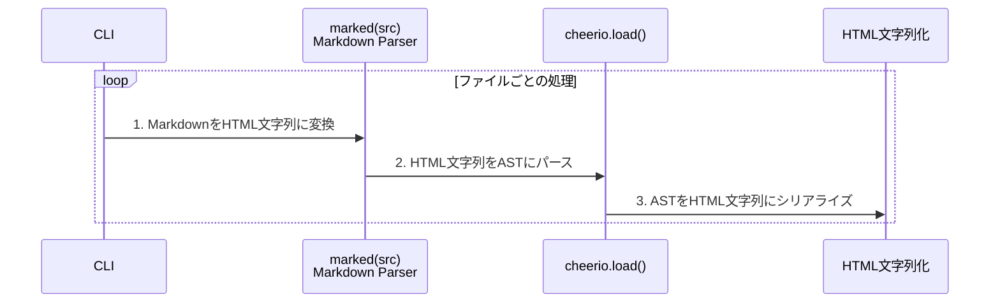
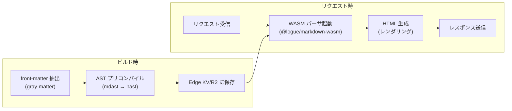

## はじめに

Zennのようなブログ記事やAstroなどの静的サイトジェネレーターが、どのようにMarkdownを受け取り、ドキュメントを生成しているのか。  

その仕組みに強い関心を抱いた私はAstroの *Content Collections* のソースコードを読み始めました。とりわけ印象的だったのは、フロントマターを抽出する `gray-matter` でメタデータを取り出しつつ、本文をunifiedパイプラインへ流し込む一連の設計です。

この記事では、そうした実装を眺めた好奇心から始まり、多重パース時代の課題、ASTリレーがもたらした転換点やMDX 3・WASM・Edgeが広げる近未来までを、コードと図を交えながら俯瞰します。

## 第一世代：多重パース時代

Markdown変換ライブラリの草創期を支えた `markdown-it` や `marked` は、変換ステップごとに文字列を再パースする仕組みを採っていました。MarkdownをHTMLにしたあと、別のフィルターをかけるたびにHTMLを再び文字列として読み込み直し、新しいASTを作り直していたのです。

次のシーケンス図が示すように、ASTを何度も破棄・再生成するループがボトルネックを生み出していました。



ファイル数が百単位から千単位に増えた途端、ビルドが劇的に遅くなる原因はこのループにあったのです。

```ts:example.ts
import fs from 'fs';
import path from 'path';
import { marked } from 'marked';
import cheerio from 'cheerio';

const DIR = './markdown-files'; // .md ファイル格納ディレクトリ

async function build() {
  const files = fs.readdirSync(DIR).filter(f => f.endsWith('.md'));
  for (const file of files) {
    const src      = fs.readFileSync(path.join(DIR, file), 'utf-8');
    const htmlText = marked(src);               // 1. Markdown → HTML文字列
    const $        = cheerio.load(htmlText);    // 2. HTML文字列 → AST
    const result  = $.html();                   // 3. AST → HTML文字列
  }
}

````

## 第二世代：AST リレーの誕生
[unified](https://github.com/unifiedjs/unified)では再パースを排し、速度を生みました。unifiedの核心は「1つのASTをリレーする」設計にあります。これは駅伝のようなもので、各プラグインがランナーとなってASTというバトンを次々と受け渡していくイメージです。

従来の方法では、手紙を何度も封筒に入れ直すように、各変換ステップで文字列→パース→変換→文字列化を繰り返していました。

remarkプラグインはmdastを直接操作し、rehypeプラグインはhastを直接操作します。`remark-rehype` はmdastをhastに変換するだけで、文字列化は行いません。この「木構造をメモリ上で受け渡す」アプローチが、高速な処理を可能にしているのです。

```ts:example.ts
import { unified } from 'unified';
import remarkParse from 'remark-parse';
import remarkRehype from 'remark-rehype';
import rehypeStringify from 'rehype-stringify';

export const mdProcessor = unified()
  .use(remarkParse)        // Markdown → mdast(Markdown AST)
  .use(remarkRehype)       // mdast → hast(HTML AST)
  .use(rehypeStringify);   // hast → HTML
```

そしてunifiedの真骨頂は、覚えた `.use()`APIをそのまま別ドメインに流用できる点にあります。たとえば、先のMarkdown→HTMLチェーンと同じ感覚でNLCST（自然言語テキストAST）を扱うには、以下のようにプラグインを差し替えるだけです。

```ts:example.ts
import { unified } from 'unified';
import nlcstParse from 'nlcst-parse';
import { visit } from 'unist-util-visit';

const nlpProcessor = unified()
  .use(nlcstParse);      // plain text → nlcst tree

const tree = nlpProcessor.parse('これはNLCSTの例テキストです。');
visit(tree, 'WordNode', node => {
  console.log('単語:', node.value);
});
```

この統一された仕組みによって、APIの切り替えによる学習コストや思考の断絶は一切発生しません。MarkdownでもHTMLでも自然言語でも、同じ手順でASTを受け取り、必要な変換や解析をシームレスに追加できるのがunifiedの最大の強みです。

### 余談：gray-matter の位置づけ

では冒頭で触れた `gray-matter` がどの工程を担うのか疑問に思われるかもしれません。Astroをはじめ多くのSSGは、本文をパイプラインへ渡す前にfront-matterを抽出する仕組みを備えており、そこで利用されるのが `gray-matter` です。あくまでメタデータ用の前処理を担うライブラリであり、本文のAST変換には関与しません。そのため本稿では核心を成すASTリレー部分に焦点を当て、`gray-matter` は余談として扱っています。

とはいえfront-matterを型安全に扱う上で不可欠な存在であり、Astro Content Collectionsが型推論を成立させている背景にも`gray-matter`が密接に関わっています。

第二世代でASTリレーの設計が完成し、Markdown→HTMLの高速変換が当たり前になる土台が築かれました。そこからさらに一歩踏み込んだのが、ユーザーが書いたコードを“そのまま動く”形で埋め込むインタラクティブ拡張です。

次章では、第2世代で確立したunifiedの思想を踏襲します。一度のパースで多彩な変換を可能にしつつ、MDX 3と `rehype-mdx-code-props` がライブコード埋め込みを標準化する仕組みを解説します。

## 第3世代：インタラクティブ拡張が標準に

2023年に正式リリースされた **MDX 3** は、Markdown内に記述したJSXコードをライブデモとして動作させる体験を標準化しました。  

`rehype-mdx-code-props` v3の導入により、コードフェンスのメタ文字列が自動でJSXのpropsにマッピングされる仕組みが整いました。これにより、開発者はオプションを数文字追加するだけでインタラクティブなコンポーネントを埋め込めるようになります。

かつてのMDXでは、Markdown部分とJavaScript／JSX部分を別々のAST（mdastとESTree）で扱い、統合するのに二重のパースが必要でした。

例えば、次のようなMDXファイルがあったとします。

```jsx:mdx
import React from 'react';

# Welcome to MDX

<Alert type="info">
  This is an MDX component!
</Alert>
```

この場合、従来のツールチェーンではまず`# Welcome to MDX` をmdast（Markdown AST）に変換し、同ファイルの先頭にあるimport文や`<Alert>`タグはスキップします。続いて、BabelなどのJavaScriptパーサーが同じファイルを再度読み込み、ESMのimport文とJSXをESTree（JavaScript AST）に変換します。

結果として同一ファイルを二度パースしなければならず、Markdown部分とJSX部分の整合を取るために複雑なマッピング処理が必要でした。

MDX 3は、`micromark-extension-mdx-jsx` と `mdast-util-mdx-jsx` を組み合わせて、ESMとJSXの両方のノードをひとつのAST上に共存させます。その結果、Markdown→JSX→HTMLの変換を `.use()` チェーンだけで完結できる設計へと進化しました。


結果として、コードフェンスに `live run filename="Demo.jsx"` と書くだけで、次のようなコンポーネント呼び出しに変換されます。

```jsx:mdx
```js live run filename="Demo.jsx"
export default function Demo() {
  return <div>Hello Demo</div>;
}
```
```jsx:mdx
<SandpackCode live run filename="Demo.jsx">
{
 `export default function Demo() {
    return <div>Hello Demo</div>;
 }`
}
</SandpackCode>
```

この仕組みでは、ASTをJSXに変換する段階でpropsが自動注入され、コンポーネントが組み上がります。結果として、開発者はコードフェンスに一行書くだけでフル機能付きデモを手にできます。

## 第4世代：ビルド 0 秒を目指す Edge & WASM

**もし、WASMパーサーとEdge実行環境が本格普及すれば、Markdown→HTML の変換はリクエスト時に行う“ビルド 0 秒”戦略が現実になるかもしれません。**

従来はビルド時にMarkdown→HTMLの変換をすべて終えていました。しかしWASMパーサとEdge実行環境を組み合わせることで、リクエスト時に本文だけを変換し、ビルド工程をほぼ不要にする戦略が見えてきました。



front-matterは従来どおりビルド時に抽出・型付けし、本文のASTも同時にプリコンパイルしてEdge KV（またはR2）に格納しておきます。リクエスト時にはMarkdownのみをWALMビルドに任せ、軽量かつ高速にHTMLを生成します。

**WASM パーサの軽量さ**  
[@logue/markdown-wasm](https://github.com/Logue/markdown-wasm) はgzip後約87.83 KBで配布可能なWebAssembly実装です。依存関係を持たずにCommonMarkを毎秒400 KiB超の速度で解析できます。

**Edge 実行環境の即時起動**  
[Cloudflare Workersのアイソレート技術](https://blog.cloudflare.com/eliminating-cold-starts-with-cloudflare-workers/) では、WASM関数を5 ms未満でウォームスタートし、コールドスタートゼロに近い動作が可能になりました。これによりリクエスト時のパースからレンダリングをほぼ瞬時に行えます。

この技術がもたらす最大の変革は **遅延レンダリング戦略** の実用化です。「更新ボタンを押して即反映」という体験をビルド工程なしで実現できます。

### Astro Content Graph API ― ライブ CMS への布石

この記事の冒頭で触れたように、Astroの内部実装を調べていました。その中で **Content Graph API** に注目しています。Astroのロードマップで議論されている [Content Graph API](https://github.com/withastro/roadmap/issues/698) が実装されれば、ローカルとリモートのコンテンツを単一の型付きクエリで扱い、その結果をEdge KVにキャッシュできます。これにより「保存時プリコンパイル＋リクエスト時レンダリング」という新しいコンテンツ配信パラダイムが完成し、ビルド時間は限りなくゼロに近づくでしょう。  

## まとめ

この記事では、第1世代の再パース地獄から、第2世代のASTリレー、第3世代のMDX 3インタラクティブ拡張までの進化を解説しました。さらに、第4世代としてEdge＋WASMによる “ビルド0秒” 戦略についても俯瞰しています。AstroやContent Collectionsの実装については [withastro/astro GitHub リポジトリ](https://github.com/withastro/astro) をご覧ください。コミュニティやロードマップの最新情報は [WithAstro Discord](https://discord.com/invite/withastro)で議論されています。

最後にmarkdown-wasmをEdge Functions上で試せば、本稿で示した進化の一端を手元で体験できます。興味を持たれた方はぜひそちらもチェックしてみてください。
