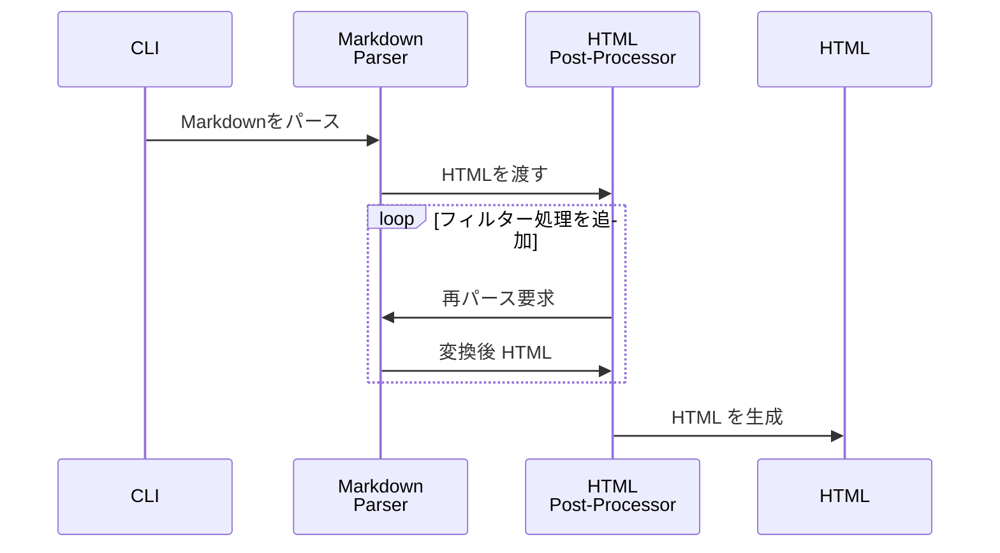
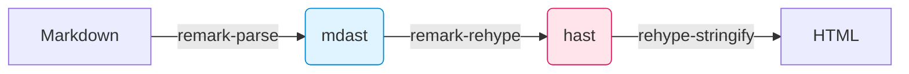

ZennやAstroなどの静的サイトジェネレーターが、どのようにMarkdownを受け取り、最終的なブログ記事やドキュメントを生成しているのか。  

その仕組みに強い関心を抱いた私はAstroの *Content Collections* のソースコードを読み始めました。とりわけ印象的だったのは、フロントマターを抽出する `gray-matter` でメタデータを取り出しつつ、本文をunifiedパイプラインへ流し込む一連の設計です。

この記事では、そうした実装を眺めた好奇心から始まり、多重パース時代の課題、ASTリレーがもたらした転換点やMDX 3・WASM・Edgeが広げる近未来までを、コードと図を交えながら俯瞰します。

## 第一世代：多重パース時代

Markdown変換ライブラリの草創期を支えた `markdown-it` や `marked` は、変換ステップごとに文字列を再パースする仕組みを採っていました。MarkdownをHTMLにしたあと、別のフィルターをかけるたびにHTMLを再び文字列として読み込み直し、新しいASTを作り直していたのです。

次のシーケンス図が示すように、ASTを何度も破棄・再生成するループがボトルネックを生み出していました。



ファイル数が百単位から千単位に増えた途端、ビルドが劇的に遅くなる原因はこのループにあったのです。

## 第二世代：AST リレーの誕生

unifiedでは再パースを排し、速度を生みました。unifiedの核心は「1つのASTをリレーする」設計にあります。これは駅伝のようなもので、各プラグインがランナーとなってASTというバトンを次々と受け渡していくイメージです。

従来の方法では、手紙を何度も封筒に入れ直すように、各変換ステップで文字列→パース→変換→文字列化を繰り返していました。

remarkプラグインはmdastを直接操作し、rehypeプラグインはhastを直接操作します。`remark-rehype` はmdastをhastに変換するだけで、文字列化は行いません。この「木構造をメモリ上で受け渡す」アプローチが、高速な処理を可能にしているのです。

```ts:example.ts
import { unified } from 'unified';
import remarkParse from 'remark-parse';
import remarkRehype from 'remark-rehype';
import rehypeStringify from 'rehype-stringify';

export const mdProcessor = unified()
  .use(remarkParse)        // Markdown → mdast
  .use(remarkRehype)       // mdast → hast
  .use(rehypeStringify);   // hast → HTML
```



unifiedの最大の強みは、一度覚えた `.use()` を使ったプラグインチェーンの考え方やAPIを、そのままMarkdown→HTMLだけでなく自然言語処理（NLP）にも適用できる点です。たとえば、`remark-parse`→`remark-rehype`→`rehype-stringify` の流れでMarkdown→HTML変換を実現するように、`rehype-parse`→`rehype-rehype`→`rehype-stringify` でHTML変換を組み立てられます。さらに `unified().use(nlcstParse).use(nlcstVisitor)` を用いれば、同じAPIでテキストの構造解析や校正も行えます。

こうした統一された仕組みにより、APIの切り替えによる学習コストや思考の断絶がなくなり、扱うコンテンツの幅を自在に広げることが可能になります。

### 余談：gray-matter の位置づけ

では冒頭で触れた `gray-matter` がどの工程を担うのか疑問に思われるかもしれません。Astroをはじめ多くのSSGは、本文をパイプラインへ渡す前にfront-matterを抽出する仕組みを備えており、そこで利用されるのが `gray-matter` です。あくまでメタデータ用の前処理を担うライブラリであり、本文のAST変換には関与しません。そのため本稿では核心を成すASTリレー部分に焦点を当て、`gray-matter` は余談として扱っています。

とはいえfront-matterを型安全に扱う上で不可欠な存在であり、Astro Content Collectionsが型推論を成立させている背景にも`gray-matter`が密接に関わっています。

第二世代でASTリレーの設計が完成し、Markdown→HTMLの高速変換が当たり前になる土台が築かれました。そこからさらに一歩踏み込んだのが、ユーザーが書いたコードを“そのまま動く”形で埋め込むインタラクティブ拡張です。

次章では、第2世代がもたらした「一度のパースで多彩な変換を可能にするunifiedの思想」を引き継ぎつつ、MDX 3とrehype-mdx-code-propsがどのようにライブコード埋め込みを標準化しているかを見ていきます。

## 第3世代：インタラクティブ拡張が標準に

2023年に正式リリースされた **MDX 3** は、Markdownに埋め込んだJSXコードをライブデモとして動作させる体験を標準化しました。そして続く `rehype-mdx-code-props` v3によって、コードフェンスの情報文字列が自動的にJSXのpropsにマッピングされる仕組みが整い、開発者はわずか数文字のオプション指定だけで複雑なインタラクティブコンポーネントを埋め込めるようになりました。

かつてのMDXでは、Markdown部分とJavaScript／JSX部分を別々のAST（mdastとESTree）で扱い、統合するのに二重のパースが必要でした。

例えば、次のようなMDXファイルがあったとします。

```jsx:mdx
import React from 'react';

# Welcome to MDX

<Alert type="info">
  This is an MDX component!
</Alert>
```

この場合、従来のツールチェーンではまず`# Welcome to MDX` をmdast（Markdown AST）に変換し、同ファイルの先頭にあるimport文や`<Alert>`タグはスキップします。続いて、BabelなどのJavaScriptパーサーが同じファイルを再度読み込み、ESMのimport文とJSXをESTree（JavaScript AST）に変換します。

結果として同一ファイルを二度パースしなければならず、Markdown部分とJSX部分の整合を取るために複雑なマッピング処理が必要でした。

MDX 3では `micromark-extension-mdx-jsx` と `mdast-util-mdx-jsx` といったunifiedの拡張プラグインが1つのAST上にESMノードとJSXノードを共存させることで、Markdown→JSX→HTMLの流れを `.use()` チェーンだけで完結できる設計へと進化しています。

結果として、コードフェンスに `live run filename="Demo.jsx"` と書くだけで、

```mdx:mdx
```js live run filename="Demo.jsx"
export default function Demo() {
  return <div>Hello Demo</div>;
}
```
次のようなコンポーネント呼び出しに変換されます。

```jsx:mdx
<SandpackCode live run filename="Demo.jsx">
{
 `export default function Demo() {
    return <div>Hello Demo</div>;
 }`
}
</SandpackCode>
```
AST→JSXの変換過程で自動的にpropsが注入されたコンポーネントが組み立てられるようになるのです。「書くのは一行、動くのはフル機能付きデモ」という体験が確立されました。

## 第4世代：ビルド 0 秒を目指す Edge & WASM

**もし WASM パーサーと Edge 実行環境が本格普及すれば、Markdown→HTML の変換はリクエスト時に行う“ビルド 0 秒”戦略が現実になるかもしれません。**

@logue/markdown-wasmをはじめとするmicromark派生のWASMビルドは2025年現在、gzip後わずか88 KB・依存ゼロでCommonMarkを毎秒400 KiB超で処理します。WasmEdgeのような軽量ランタイム上ならVercel Edge FunctionsやCloudflare Workersのcold-startも数ミリ秒に抑えられるという報告があったのです。

この技術がもたらす最大の変革は **「遅延レンダリング戦略」** の実用化です。front-matter抽出はビルド時に済ませつつ、本文のMarkdown→HTML変換だけをリクエスト時にWASMで処理すれば、「更新ボタンを押して即反映」という体験をビルド工程なしで実現できます。

### Astro Content Graph API ― ライブ CMS への布石

この記事の冒頭にも書いたのですが、Astroの内部実装を眺めています。その時に、目に入ったのが**Content Graph API**です。
Astroチームがロードマップで示す **Content Graph API** が実装されれば、ローカルとリモートのコンテンツを型付きクエリで横断し、変換結果をEdge KVへキャッシュすることでビルド時間を限りなく0秒に近づけるアーキテクチャが可能になるそうです。

### まとめ

この記事では、かつて再パースに悩まされた第1世代から、ASTリレーが定着した第2世代、MDX 3のインタラクティブ拡張が標準化した第3世代、そしてEdge＋WASMでビルド0秒を目指す第4世代までを俯瞰しました。

最後にmarkdown-wasmをEdge Functions上で試せば、本稿で示した進化の一端を手元で体験できます。

詳細なAPIや最新の企画はunifiedjsやAstroのGitHubリポジトリ、またWithAstro Discordで随時アップデートされています。興味を持たれた方はぜひそちらもチェックしてみてください。


